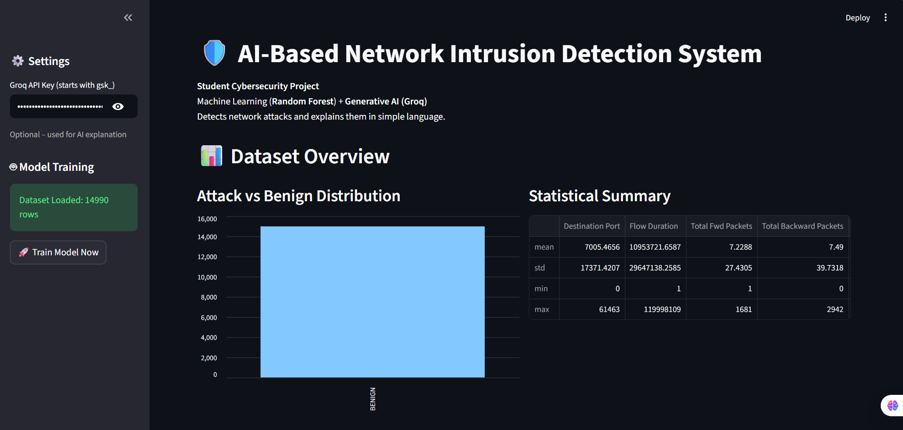
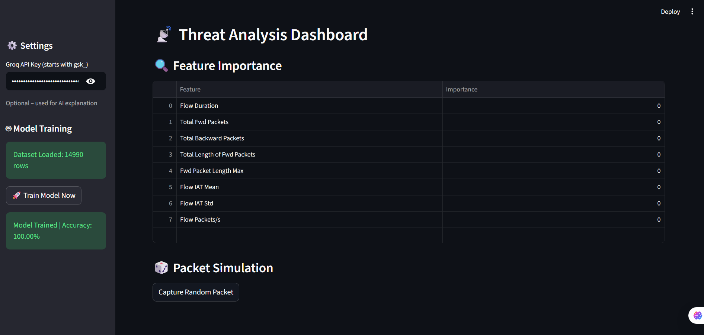
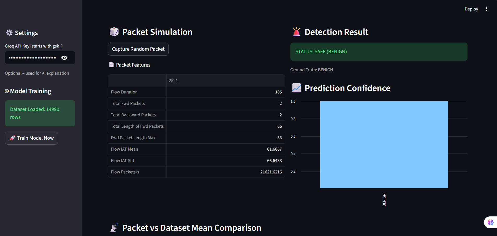
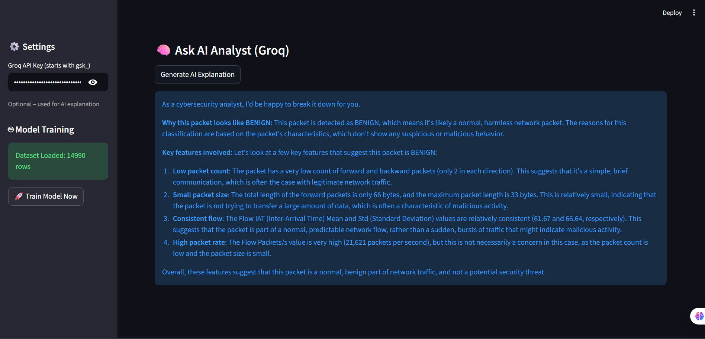

# 🛡️ AI-Based Network Intrusion Detection System (AI-NIDS)

An **AI-powered Network Intrusion Detection System** built as a **Student Cybersecurity Project**, combining **Machine Learning (Random Forest)** and **Generative AI (Groq LLM)** to detect and explain network attacks such as **DDoS** using an interactive **Streamlit dashboard**.

---

## 🚀 Live Deployment (Hugging Face Spaces)

🔗 **Live App Link:**  
https://huggingface.co/spaces/SonuKumarAnalyst/AI-Based_Network_Intrusion_Detection_System 

This application is deployed on **Hugging Face Spaces** using the **Streamlit SDK** and runs entirely in the browser without requiring any local setup.

---

## 🎯 Project Objective

The objective of this project is to demonstrate how traditional **Machine Learning models** can be integrated with modern **Large Language Models (LLMs)** to build an intelligent, explainable, and user-friendly **Network Intrusion Detection System** suitable for academic projects, cybersecurity internships, and technical demonstrations.

---

## ✨ Key Features

- Random Forest based network intrusion detection  
- Detection of **BENIGN vs DDoS** network traffic  
- Interactive Streamlit web dashboard  
- Attack vs Benign traffic visualization  
- Feature importance analysis  
- Prediction confidence visualization  
- Packet vs dataset mean comparison  
- AI-based explanation using **Groq LLM**  
- Fully deployed on **Hugging Face Spaces**

---

## 🧠 Technology Stack

- **Programming Language:** Python  
- **Web Framework:** Streamlit  
- **Machine Learning:** Random Forest (Scikit-learn)  
- **Data Processing:** Pandas, NumPy  
- **Visualization:** Matplotlib, Streamlit Charts  
- **Generative AI:** Groq API  

---

## 📂 Project Structure
    
    AI-NIDS-Student-Project/  
    ├── app.py  
    ├── requirements.txt  
    ├── README.md  
    ├── .gitignore  

---

## 📊 Dataset Information

This project uses a subset of the **CIC-IDS2017 dataset**, specifically the **Friday Afternoon DDoS traffic**.

📥 **Dataset Download Link:**  
https://www.unb.ca/cic/datasets/ids-2017.html  

**Required CSV file name:**  
Friday-WorkingHours-Afternoon-DDos.pcap_ISCX.csv  

Due to the large size of the dataset, it is **not included** in this GitHub repository and must be downloaded manually and placed in the project directory.

---

## 🖼️ Application Screenshots

Add screenshots of the Streamlit app inside a folder named `images/` and update the paths below.

### Dashboard Overview

### Feature Importance Analysis

### Prediction Confidence Graph

### AI Explanation Output

---

## ▶️ How to Run Locally

Clone the repository:  
git clone https://github.com/YOUR_USERNAME/AI-NIDS-Student-Project.git  
cd AI-NIDS-Student-Project  

Install dependencies:  
pip install -r requirements.txt  

Run the application:  
streamlit run app.py  

---

## 🔐 Groq API Key Setup

For AI-based explanation, a **Groq API key** is required.

- When running locally, provide the key inside the application interface if enabled  
- When deploying on Hugging Face Spaces, add the API key securely using **Secrets**  
- Secret Name: `GROQ_API_KEY`  

The key is handled securely and is never exposed in the source code.

---

## 🌐 Deployment Details

- **Platform:** Hugging Face Spaces  
- **SDK:** Streamlit  
- **Hardware:** CPU (Free Tier)  
- **Environment:** Python  

---

## 🎓 Use Cases

- Cybersecurity Internship Project  
- Academic mini / final year project  
- Machine Learning + LLM integration demo  
- Network security learning and visualization tool  

---

## 🧑‍💻 Author

**Sonu Kumar**

---

⭐ If you find this project useful, consider giving it a star on GitHub!
